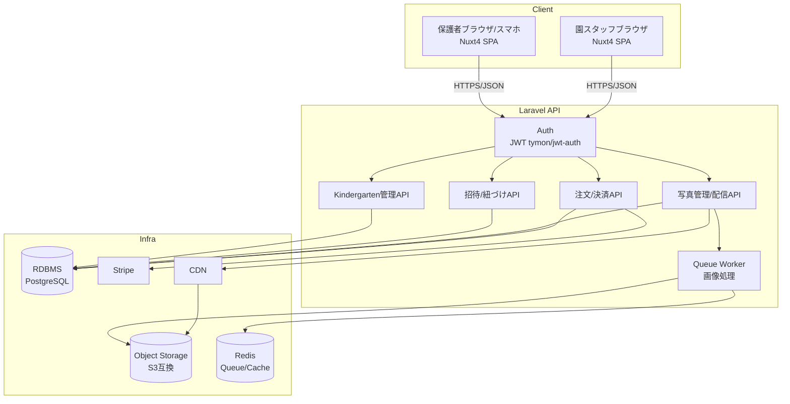

# 写真販売プラットフォーム 設計概要

## 1. サービス概要

保育園・幼稚園向けの写真販売SaaS。園側（写真の販売者）と保護者側（購入者）の
2種類のユーザーが存在し、保護者は自分の子供が写っている写真のみ閲覧・購入できる。

## 2. 確定済み要件

- 保護者アカウントの新規登録は、園側が事前に発行した招待URL（QRコード化）を
  読み込むことでアカウントと園児が紐づく
- 招待URL（トークン）は **1回しか使えない**（ワンタイム）
- 1園児につき **複数の保護者**（父・母など）が紐づく想定 → 園側は園児ごとに
  QRコードを複数枚（父用・母用）発行・印刷して配布する
- 1アカウントに **複数園児**（兄弟姉妹）が紐づくことを許容する
- 園側の管理画面から、保護者と園児の紐づけを **解除できる**（卒園・誤登録対応）
- 決済の入金先は運営者口座への一元集約ではなく、**Stripe Connectで園ごとの
  アカウントに直接入金**する（資金移動業等の規制リスク回避のため）
- フロントエンド: Nuxt 4 / バックエンド: Laravel

## 3. マルチテナント方針

園（kindergarten）単位でデータを分離するシングルDB・マルチテナント構成とする。
個人開発のポートフォリオ規模ではDB分割・スキーマ分割は過剰なため、主要テーブルに
`kindergarten_id` を持たせて論理分離する方式を採用する。

- メリット: 運用がシンプル、マイグレーション・バックアップが1系統で済む
- 留意点: 全クエリで `kindergarten_id` のスコープ漏れがないよう、Laravelの
  [Global Scope](https://laravel.com/docs/eloquent#global-scopes) を使い、
  スタッフ（園側）のクエリには自動でテナント条件を付与する

## 4. システム構成図

## 5. ドキュメント構成

| ファイル | 内容 |
|---|---|
| [01_overview.md](./01_overview.md) | 本ファイル。要件・全体構成 |
| [02_data_model.md](./02_data_model.md) | ER図、テーブル定義 |
| [03_invitation_flow.md](./03_invitation_flow.md) | QR招待・紐づけ・解除フロー詳細 |
| [04_auth_and_authorization.md](./04_auth_and_authorization.md) | 認証方式、写真閲覧・購入の認可ロジック |
| [05_tech_stack.md](./05_tech_stack.md) | 技術選定と理由 |
| [06_open_questions.md](./06_open_questions.md) | 未確定事項・今後の検討課題 |
| [08_features.md](./08_features.md) | 機能一覧（園側・保護者側） |
| [09_domain_model.md](./09_domain_model.md) | ドメインモデル（集約境界・不変条件） |
