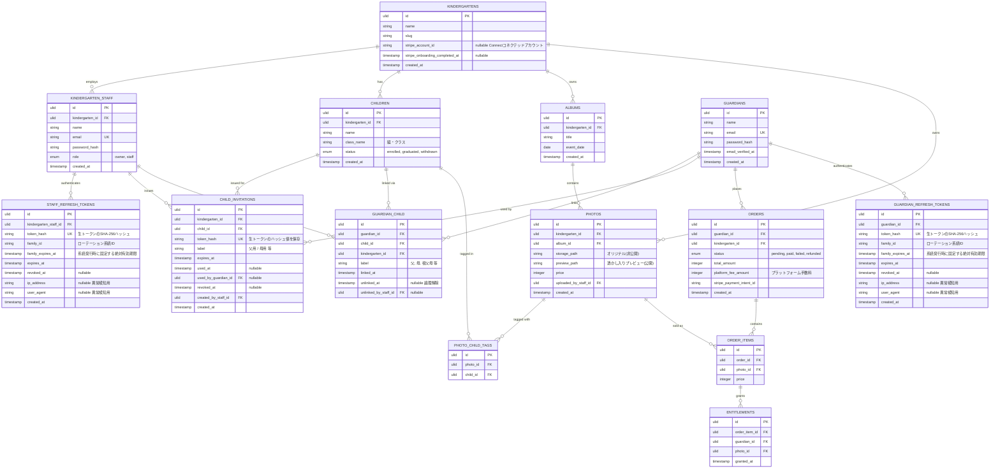

# データモデル設計

## 1. ER図

## 2. 設計上の要点

### 2.1 `guardians` はテナントに属さない

保護者は将来的に複数の園（例: 上の子が卒園し下の子が別の園に通う等）に
子供が分散するケースがあり得るため、`guardians` テーブル自体には
`kindergarten_id` を持たせない。どの園と関わりがあるかは
`guardian_child.kindergarten_id` を経由して判定する。

### 2.2 紐づけ解除は物理削除ではなく論理削除

`guardian_child.unlinked_at` を立てる論理削除方式とする。理由:

- 購入履歴（`orders`）は解除後も保護者側・園側の双方で参照できる必要がある
- 誤操作による解除を「再紐づけ」で復元しやすくする
- 「いつ・誰が解除したか」の監査証跡を残す（`unlinked_by_staff_id`）

写真の閲覧・購入可否の判定には、**常に `unlinked_at IS NULL` の行のみ**を
有効な紐づけとして扱う（[04_auth_and_authorization.md](./04_auth_and_authorization.md) 参照）。

### 2.3 招待トークンは平文をDBに保存しない

`child_invitations.token_hash` にはトークンの SHA-256 ハッシュのみを保存し、
生トークンはURL発行時にしか存在しない（パスワードリセットトークンと同じ扱い）。
詳細は [03_invitation_flow.md](./03_invitation_flow.md) を参照。

### 2.4 写真と園児の関係は多対多（タグ付け）

1枚の写真に複数の園児が写ることがあるため、`photo_child_tags` で多対多に
する。タグ付けは当面は園スタッフの手動作業を想定（顔認識による自動タグ付けは
将来拡張として [06_open_questions.md](./06_open_questions.md) に記載）。

### 2.5 購入権利（entitlements）をorder_itemsと分離

`order_items` は「注文明細」、`entitlements` は「ダウンロード可能な権利」として
テーブルを分ける。理由: 返金時に `entitlements` だけを失効させる、贈与・
再発行などの将来拡張がしやすい。過剰設計に見えるが、決済まわりは後からの
仕様変更が多い領域のため、明細と権利を最初から分離しておく価値がある。

#### `entitlements.guardian_id` は意図的な非正規化

`guardian_id` は `order_item_id → order_items.order_id → orders.guardian_id`
と辿れば導出できるため、正規化の観点では冗長である。しかし以下の理由から、
`entitlements` テーブルに独立したカラムとして持たせる。

- **ダウンロード可否判定のクエリを単純化するため**: `PhotoPolicy::download()`
  （[04_auth_and_authorization.md §5](./04_auth_and_authorization.md)）は
  署名付きダウンロードURLを発行するたびに呼ばれるホットパスであり、
  `entitlements(guardian_id, photo_id)` の複合インデックスだけで判定できる
  設計にしておくことで、`orders` テーブルまでJOINするコストを避ける
- **将来の贈与・再発行機能との相性**: 「購入者」と「ダウンロード権利の保有者」が
  将来的に分離するケース（例: Aさんが購入した写真の権利をBさんに贈与する）に
  備え、`entitlements.guardian_id`（権利保有者）を `orders.guardian_id`
  （購入者）から独立して持たせておく

通常の購入フローでは `Order` 確定と同一トランザクション内で `entitlements` を
生成するため、両カラムが食い違うことはない（贈与機能を実装する際は、
`entitlements.guardian_id` の更新のみで対応できる想定）。

### 2.6 主キーは ULID

日時ソート可能・推測困難という理由で連番IDではなく ULID を採用する。
特に `child_invitations` のような外部公開されうるIDは連番だと推測・
列挙攻撃のリスクがあるため重要（ただし招待トークン自体は別途ハッシュ化するため
IDの推測耐性は補助的な位置づけ）。

### 2.7 決済の入金先はテナント（園）ごとに分離する（Stripe Connect）

保護者からの購入代金を運営者の口座に一元集約し、後から園へ振り込む方式は、
実質的に「他人の資金を預かって送金する」行為に近く、資金移動業等の規制に
抵触するリスクがある。そのため **Stripe Connect（Standardアカウント）** を採用し、
園ごとに専用のコネクテッドアカウント（`kindergartens.stripe_account_id`）を持たせ、
購入代金は Destination Charge により**園のアカウントへ直接入金**し、運営者は
`orders.platform_fee_amount` に相当する手数料分のみを自動で受け取る。

- 園はテナント登録後、管理画面からStripeのオンボーディング（本人確認・銀行口座
  登録）へ遷移して `stripe_account_id` を取得する。本人確認・口座情報の管理は
  Stripe側に委譲するため、運営者は機密情報を扱わない
- `stripe_onboarding_completed_at` が未設定（オンボーディング未完了）の園は、
  写真の購入導線を無効化する
- Webhook（`account.updated`）で `charges_enabled` の状態を監視し、
  `stripe_onboarding_completed_at` を更新する

### 2.8 リフレッシュトークンはguardごとに別テーブルで管理する

認証にはJWT（`tymon/jwt-auth`）を採用し、アクセストークンはDBに保存しない
ステートレスなトークンとするが、**リフレッシュトークンだけはステートフルに
DB管理**する（盗難時に失効させられるようにするため。詳細は
[04_auth_and_authorization.md §3](./04_auth_and_authorization.md)）。

- `kindergarten_staff` と `guardians` を1つの`users`テーブルに統合しない
  方針（[04_auth_and_authorization.md §2](./04_auth_and_authorization.md)）
  と一貫させ、リフレッシュトークンも `staff_refresh_tokens` /
  `guardian_refresh_tokens` に**テーブルレベルで分離**する
- `token_hash` には生トークンのSHA-256ハッシュのみを保存する
  （`child_invitations.token_hash` と同じ方針。2.3節参照）
- `family_id` は1回のログインから始まるリフレッシュトークンのローテーション
  系統をまとめるIDで、再利用検知時にはこの単位で一括失効させる
  （他デバイスの正常なセッションを巻き込まないため）
- `family_expires_at` はローテーションで延長されない固定の絶対有効期限。
  再利用検知が働かなかった場合でも一定期間でセッションを強制終了させる
  ためのフェイルセーフ
