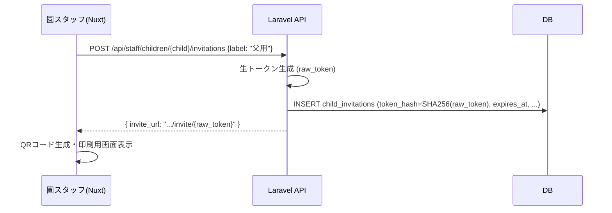
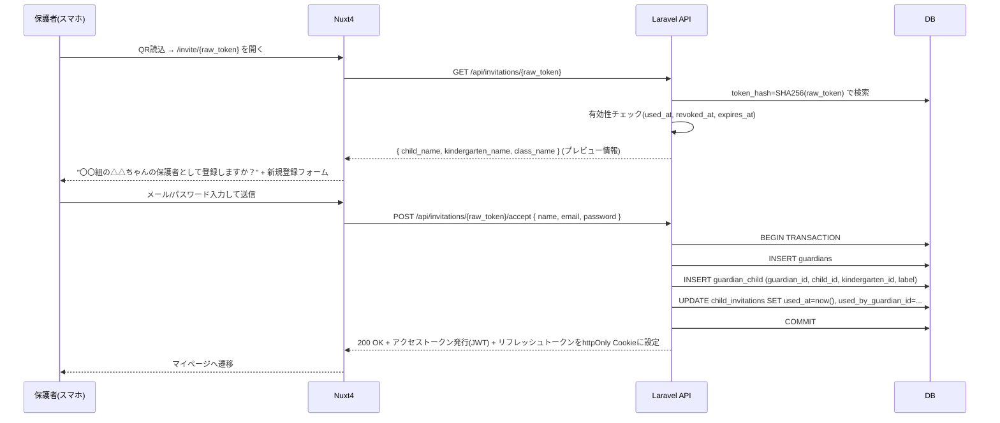

# QR招待・紐づけ・解除フロー

## 1. トークン発行（園側）

1. 園スタッフが管理画面で園児を選択し、「保護者を招待」を実行する
   （ラベル「父用」「母用」などを添えて、園児1人につき必要な枚数を発行する）
2. サーバーは暗号学的に安全なランダム文字列（生トークン、例: 32byte urlsafe base64）を生成
3. DBには生トークンの **SHA-256ハッシュ** のみを `child_invitations.token_hash` として保存する
   （パスワードリセットトークンと同様、DB漏洩時にトークンを復元できないようにするため）
4. 生トークンを含む招待URL（例: `https://app.example.com/invite/{raw_token}`）をQRコード化し、
   園側管理画面上でPDF/印刷用画面として出力する
5. 有効期限（例: 発行から90日）を設定する。紙のQRは配布・保管に時間がかかるため、
   パスワードリセット用トークンより長めの期限を持たせる

## 2. 紐づけ（保護者側・未登録の場合）

## 3. 紐づけ（保護者側・ログイン済み、兄弟姉妹の追加紐づけ）

既にアカウントを持つ保護者が、別の子供（兄弟姉妹）の招待QRを読み込むケース。

1. ログイン済みの状態で `/invite/{raw_token}` を開く
2. 会員登録フォームは表示せず、「〇〇ちゃんを追加しますか？」の確認画面のみ表示
3. `POST /api/invitations/{raw_token}/accept` はリクエストの `Authorization` ヘッダーの
   アクセストークンから復号した `guardian_id` を使って `guardian_child` を追加し、
   トークンを使用済みにする

未ログイン状態でQRを読み、かつ既存メールアドレスで登録しようとした場合は、
新規登録ではなくログインを促し、ログイン後に同じ accept フローへ合流させる。

## 4. トークンの無効化パターン

| ケース | 挙動 |
|---|---|
| 使用済み（`used_at` が設定済み） | 403。「このQRコードは既に使用されています」 |
| 期限切れ（`expires_at` を超過） | 403。「有効期限が切れています。園に再発行を依頼してください」 |
| 園側が手動失効（`revoked_at` が設定済み） | 403。紛失・誤発行時に園側管理画面から失効させる |
| 存在しないトークン | 404（存在するかどうかを判別させない意味では403と同一メッセージでも良い） |

失効・期限切れの場合でも園スタッフは管理画面から **同じ園児に対して再発行**できる
（古いレコードは失効のまま残し、新しい `child_invitations` 行を作る）。

## 5. 紐づけ解除（園側管理画面）

1. 園スタッフが園児詳細画面で紐づけ済み保護者一覧を確認する
2. 「解除」を実行すると `guardian_child.unlinked_at`, `unlinked_by_staff_id` を設定（論理削除）
3. 解除後、その保護者は当該園児の新着写真を閲覧・購入できなくなるが、
   解除前に購入済みの写真（`entitlements`）は引き続きダウンロード可能とする
   （購入済みコンテンツへのアクセスを事後的に奪わない方針）
4. 誤操作対策として、解除操作には確認モーダルを必須とし、
   一定期間内であれば「再紐づけ」ボタンで `unlinked_at` をクリアして復元できるようにする

## 6. セキュリティ上の考慮事項

- トークンは十分なエントロピー（128bit以上）を持たせ、URLの総当たりを実用上不可能にする
- `GET /api/invitations/{raw_token}` と accept エンドポイントの両方に
  レートリミット（例: IPごとに1分10回）を設け、トークン推測攻撃を軽減する
- トークン検証〜使用済みマークまでを **DBトランザクション + 行ロック
  (`SELECT ... FOR UPDATE`)** で行い、同一トークンへの同時アクセスによる
  二重登録（TOCTOU）を防ぐ
- 招待URLはメール等で転送されうる前提を置かず、印刷QRのみを正規配布経路とする
  運用ルールを園側に案内する（URL誤送信時は園側管理画面から即座に失効できる）
